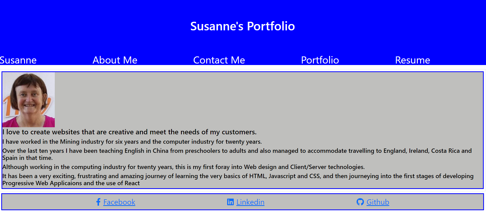

# Susanne's Portfolio

[](https://opensource.org/licenses/MIT)

## Description

This is an applicaion utilising REACT to display applications that I have written.  There are several pages; AboutMe, Contact, Portfolio and Resume.
The AboutMe page which is defaulted when the application is opened is a short introduction of myself.  The Contact Page allows the user to send an email, although at this stage I am only displaying an alert on the contact information that the user has entered.  The Portfolio page displays six applications that I have developed or as part of a team helped to develop, which includes links to executing the applications as well as links to the appropriate GITHUB repositories.  The Resume page outlines my Front End and Back End proficiencies as well as the abilty to download my resume.

## 📖Table of Contents
1. [Installation](#installation)
2. [Assets](#assets)
3. [Technologies](#technologies)
4. [License](#license)
5. [Contributing](#contributing)
6. [Tests](#tests)
7. [Questions](#questions)

## Installation
1. To install this application clone it through GitHub using the following code in the terminal: 
    ``` 
    git clone https://github.com/Susanne85/my-react-portfolio
    ```
   To add the dependencies to the application, navigate to the root directory for the application and run:
    ```js
    npm install
    npm install bootstrap
    npm install react
    npm install --save react-router-dom
    npm install --save @fortawesome/free-solid-svg-icons
    npm install --save @fortawesome/react-fontawesome
    npm install --save @fortawesome/free-brands-svg-icons
    ```
    
## Assets

Live demo of the application:  [My React Portfolio](https://susanne85.github.io/my-react-portfolio/

The following image shows the homepage of the application: 




## Technologies
- [Node.js](https://nodejs.org/en/docs/)
- [React](https://reactjs.org/)
- [JavaScript](https://www.javascript.com/)

## License

This project is [MIT](./LICENSE) licensed

## Contributing
Contributions, issues and feature requests are welcome.

Feel free to check the [issues page](https://susanne85.github.io/my-react-portfolio/issues) if you want to contribute.

## Tests

There are no tests currently for this application.

## Questions
For any questions, please contact the author:

- Github: [@Susanne](https://github.com/Susanne85)